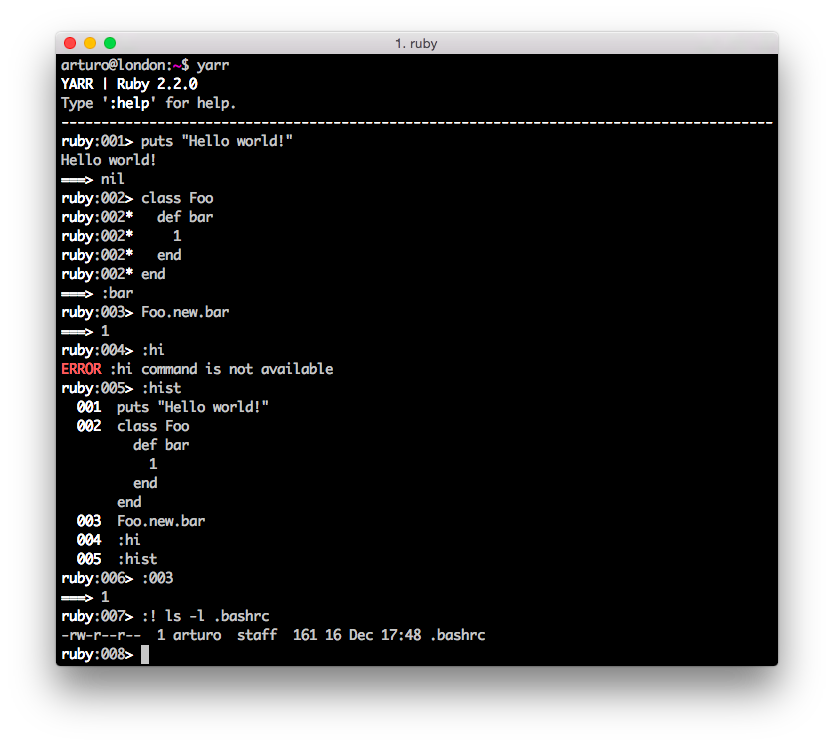

# YARR

[](https://codeclimate.com/github/arturoherrero/yarr)
[](https://travis-ci.org/arturoherrero/yarr)

**YARR (Yet Another Ruby REPL)** is a Ruby REPL (just a hobby, won't be big and
professional like [Pry][1]). YARR was inspired by groovysh<sup>[1][2]</sup>,
IRB<sup>[2][3]</sup>, Pry<sup>[3][4]</sup>, Bash
<sup>[4][5]</sup> and Vim<sup>[5][6]</sup>.

## Installation

Install the gem:

```
$ gem install yarr
```

## Features

An interactive shell for evaluating Ruby code from the command-line. YARR is a
command-line application which allows easy access to evaluate Ruby expressions,
define classes and run simple experiments. It also features command history.



### Evaluating Expressions

#### Simple Expressions

```
ruby:001> puts "Hello"
Hello
===> nil
ruby:002> [1,2,3].max
===> 3
```

#### Multi-line Expressions

Multi-line/complex expressions (like closure or class definitions) may be
defined over several lines. When the shell detects that it has a complete
expression it will evaluate it.

```
ruby:001> class Foo
ruby:001*   def bar
ruby:001*     lambda do
ruby:001*       1
ruby:001*     end
ruby:001*   end
ruby:001* end
===> :bar
ruby:002> Foo.new.bar.call
===> 1
```

#### Variables

Set a shell variable for later use.

```
ruby:001> foo = "bar"
===> bar
```

#### Functions

Functions can be defined in the shell, and will be saved for later use.

Defining a function is easy:

```
ruby:001> def hello(name)
ruby:001*   puts "Hello #{name}"
ruby:001* end
===> :hello
```

And then using it is as one might expect:

```
ruby:002> hello("Arturo")
Hello Arturo
===> nil
```

Variables and functions share the same namespace, be careful:

```
ruby:001> foo = 10
===> 10
ruby:002> def foo
ruby:002*   5
ruby:002* end
===> :foo
ruby:003> foo
===> 10
```

### Commands

The shell has a number of different commands, which provide access to the shell’s
environment.

#### `:exit` or `:quit`

Exit the shell.

This is the **only** way to exit the shell. No `Ctrl-c`, sorry.

```
ruby:001> :exit
```

#### `:help`

Display the list of commands (and aliases).

```
ruby:001> :help

Available commands:
  :exit    Exit the shell
  :help    Display this help message
  :hist    Display edit-line history
  :quit    Alias to :exit
  :number  Execute a specific expression from history
  :! cmd   Execute a shell command à la Vim

```

#### `:hist`

Display the shell history.

```
ruby:001> def foo
ruby:001*   "bar"
ruby:001* end
===> :foo
ruby:002> var = 10
===> 10
ruby:003> :! echo "Yay"
Yay
ruby:004> :hist
  001  def foo
         "bar"
       end
  002  var = 10
  003  :! echo "Yay"
  004  :hist
```

#### `:number`

Execute a specific expression from history, e.g. `:1` or `:001`.

```
ruby:001> var = 10
===> 10
ruby:002> var = 5
===> 5
ruby:003> var = 8
===> 8
ruby:004> :2
===> 5
```

#### `:! cmd`

Execute a shell command à la Vim.

```
ruby:001> :! cal
   February 2015
Su Mo Tu We Th Fr Sa
 1  2  3  4  5  6  7
 8  9 10 11 12 13 14
15 16 17 18 19 20 21
22 23 24 25 26 27 28
```

## Who made this?

This was made by Arturo Herrero under the MIT License. You can also find me on
Twitter [@ArturoHerrero][7].


[1]: http://pryrepl.org/
[2]: http://groovy-lang.org/groovysh.html
[3]: http://ruby-doc.org/stdlib/libdoc/irb/rdoc/IRB.html
[4]: http://pryrepl.org/
[5]: http://www.gnu.org/software/bash/
[6]: http://www.vim.org/
[7]: https://twitter.com/ArturoHerrero
